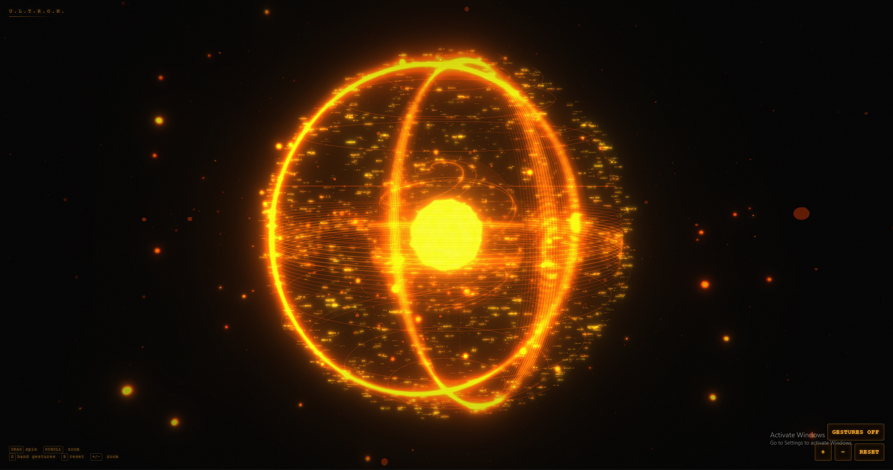

# ELISA Orb UI

A holographic orb built with **Next.js**, **Three.js**, and **MediaPipe** hand tracking — control it with your bare hands through your webcam.

> 🔮 This is the open-source **interface** of ELISA — my AI that talks in real time and controls Android devices by itself.

> 📱 **[Watch the demo on Instagram](https://www.instagram.com/p/DayJ17OTwvx/)**



https://github.com/user-attachments/assets/91578a83-9a27-44e8-84b0-96defcfd7366

## Getting started

```bash
npm install
npm run dev
```

Open [http://localhost:3000](http://localhost:3000).

## Controls

### Mouse / touch

| Input | Action |
| --- | --- |
| Drag | Spin the orb |
| Scroll / pinch | Zoom in & out |

### Hand gestures (webcam)

Click **GESTURES OFF** (or press `G`) and allow camera access, then:

| Gesture | Action |
| --- | --- |
| Pinch (thumb + index) one hand and move it | Spin the orb |
| Pinch with **both** hands, spread apart / bring together | Zoom in / out |

### Keyboard

| Key | Action |
| --- | --- |
| `G` | Toggle hand gestures |
| `R` | Reset the view |
| `+` / `−` | Zoom in / out |

## How it works

- **`lib/orbScene.ts`** — the Three.js scene: layered wireframe shells, a spiral
  inner core, floating code-text sprites, orbiting debris, dust particles, scan
  rings, and a bloom + chromatic-aberration post-processing stack.
- **`lib/handTracker.ts`** — MediaPipe HandLandmarker running on the webcam
  feed. Pinch detection with hysteresis: one pinched hand spins the orb, two
  pinched hands zoom by spreading apart or together.
- **`components/JarvisOrb.tsx`** — the HUD and glue between the scene, the
  tracker, and your inputs.

## Voice — talk to ELISA

This adds a real voice pipeline on top of the orb UI: click **TALK TO ELISA**, allow mic access, and talk. Under the hood:

- **LiveKit** — real-time audio transport between your browser and the agent
- **Deepgram** (via LiveKit Inference) — hears you
- **GPT-4.1 mini** (via LiveKit Inference) — thinks
- **ElevenLabs** (your own key) — speaks the reply

This needs two things running at once: the Next.js app, and a separate backend "agent" worker that actually holds the conversation.

### 1. Set up the frontend

```bash
cp .env.example .env.local
```

Fill in `.env.local` with your LiveKit project's URL and API key/secret (from [cloud.livekit.io](https://cloud.livekit.io) → Settings → Keys).

```bash
npm install
npm run dev
```

### 2. Set up the agent worker

In a second terminal:

```bash
cd agent
cp .env.example .env.local
```

Fill in `agent/.env.local` with the **same** LiveKit credentials, plus your ElevenLabs API key.

```bash
npm install
npm run dev
```

Leave this running — it's the process that connects as "ELISA" whenever someone joins a room from the web app.

### Notes

- LiveKit Inference (STT + LLM) is billed through your LiveKit account — no separate OpenAI/Deepgram key needed.
- ElevenLabs TTS uses your own `ELEVEN_API_KEY` and bills to your ElevenLabs account. Set `ELEVENLABS_VOICE_ID` in `agent/.env.local` to use a specific voice from your account.
- The orb's glow pulses along with ELISA's voice while she's speaking.

## License

MIT

## Realtime voice deployment

The browser token explicitly dispatches the named `elisa` agent. The agent uses Deepgram STT + LiveKit Inference GPT + the direct ElevenLabs TTS plugin so custom/community ElevenLabs voices work.

Set these variables in the Next.js/Railway web service:
- `LIVEKIT_API_KEY`
- `LIVEKIT_API_SECRET`
- `NEXT_PUBLIC_LIVEKIT_URL`
- `LIVEKIT_AGENT_NAME=elisa`

Set these variables in the agent/Railway worker service:
- `LIVEKIT_API_KEY`
- `LIVEKIT_API_SECRET`
- `LIVEKIT_URL`
- `LIVEKIT_AGENT_NAME=elisa`
- `ELEVEN_API_KEY`
- `ELEVENLABS_VOICE_ID=rhS7yjXTU4uIlRxXhNW7`

After deploying both services, press TALK TO ELISA. ELISA should immediately speak a short greeting, then answer each spoken turn. The frontend also unlocks LiveKit audio from the button gesture to avoid browser autoplay blocking.
